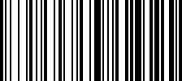

# Code128Generator

[Türkçe için tıklayın](README.md)

A simple command-line application written in C that encodes input text into a **Code 128 (Set B)** barcode and saves it as a `.bmp` file.

## Sample Output



## Features

- Code 128 Set B encoding (supports ASCII characters 32–127)
- Checksum calculation (mod 103)
- Saves the result as a black-and-white BMP to `output/barkod.bmp`
- No external library dependencies

## Build & Run

```powershell
.\build.ps1
```

This script compiles the project with `gcc`, produces `Code128Gen.exe`, and runs the program automatically.

To build manually:

```powershell
gcc -Wall -Iinclude src\main.c src\code128.c src\bmp.c -o Code128Gen.exe
```

## Usage

Run the program and enter the text you want to convert into a barcode:

```
===========================================
       Code 128 Barkod Olusturucu
===========================================

Barkoda donusturulecek metni giriniz: MERHABA123
```

The barcode is saved to `output/barkod.bmp`.

## Project Structure

```
Code128Generator/
├── include/        # Header files (code128.h, bmp.h)
├── src/            # Source files (main.c, code128.c, bmp.c)
├── output/         # Generated BMP barcodes
└── build.ps1       # Build & run script
```
